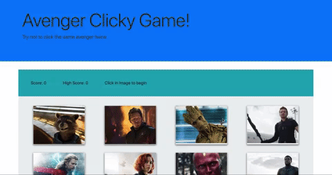

# Avenger Clicky Game

### Game Play

Users will see their current score, high score, and a message inviting them to play the game. 

To start the game, a user just needs to click on an image. Every time the user clicks on an image that was not previously clicked, their score will increase by one point. Each time an image is clicked all of the images will be randomly shuffled. 

Upon clicking on an image for the second time, the score will reset to 0 and the high score will be updated to the current score if the current score is higher than the current high score. 

Below is an example of what typical game play may look like.

