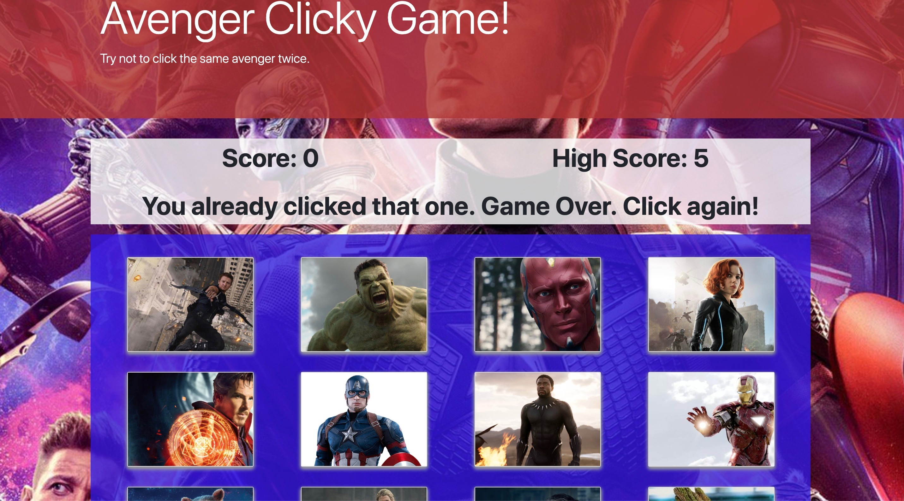

# Avenger Clicky Game

## Game Play

Users will see their current score, high score, and a message inviting them to play the game. 

### Starting the Game
To start the game, a user can click on any image. 

### Scoring Points
Every time the user clicks an image that was not previously clicked, their score will increase by one point. Each time an image is clicked all of the images will be randomly shuffled. 

### Ending the Game
Upon clicking on an image for the second time in the same round, the game is over. The score will reset to 0 and the high score will be updated to the current score if the current score is higher than the current high score. 

## Preview
Below is an example of what typical game play may look like.

